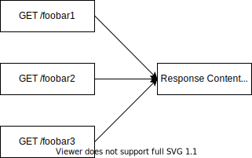
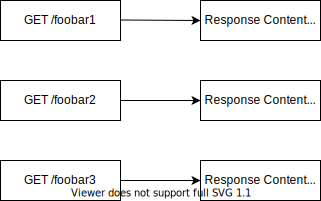

# PSR-6 compatible Symfony HttpCache Store

## Supported branches

* For PHP ^7.2 and Symfony <6, use version 3.x
* For PHP ^8.0 and Symfony >6, use version 4.x

## Introduction

Symfony's `HttpCache` store implementation is rather old and was developed
when there were no separate components for locking and caching yet. Moreover, 
expired cache entries are never pruned and thus causes your cache directory
to continue to grow forever until you delete it manually.

Along the way, I needed support for cache invalidation based on tags which was
pretty easy to implement thanks to the Symfony Cache component.

This bundle thus provides an alternative `StoreInterface` implementation
that…

* …instead of re-implementing locking and caching mechanisms again, uses the well
tested Symfony Cache and Lock components, both with the local filesystem adapters
by default.
* …thanks to the `TagAwareAdapterInterface` of the Cache component, supports tag
based cache invalidation.
* …thanks to the `PrunableInterface` of the Cache component, supports auto-pruning
of expired entries on the filesystem trying to prevent flooding the filesystem.
* …allows you to use a different PSR-6 cache adapters as well as a different 
lock adapter than the local filesystem ones.
 However, **be careful about choosing the right adapters**, see warning below.
* …supports `BinaryFileResponse` instances.

## Installation

```
$ composer require toflar/psr6-symfony-http-cache-store
```

## Configuration

For the Symfony 4/Flex structure, you need to adjust your `index.php` like this:

```php
<?php

// public/index.php
$kernel = new Kernel($env, $debug);
$kernel = new HttpCache(
    $kernel,
    new Psr6Store(['cache_directory' => $kernel->getCacheDir()]),
    null,
    ['debug' => $debug]
);
```

That's it, that's all there is to do. The `Psr6Store` will automatically
create the best caching and locking adapters available for your local filesystem.

If you want to go beyond this point, the `Psr6Store` can be configured by
passing an array of `$options` in the constructor:

* **cache_directory**: Path to the cache directory for the default cache
  adapter and lock factory.

  Either this or both `cache` and `lock_factory` are required.

  **Type**: `string`

* **cache**: Explicitly specify the cache adapter you want to use.

  Note that if you want to make use of cache tagging, this cache must
  implement the `Symfony\Component\Cache\Adapter\TagAwareAdapterInterface`
  Make sure that `lock` and `cache` have the same scope. *See warning below!*

  **Type**: `Symfony\Component\Cache\Adapter\AdapterInterface`
  **Default**: `FilesystemAdapter` instance with `cache_directory`

* **lock_factory**: Explicitly specify the lock factory you want to use. Make
  sure that lock and cache have the same scope. *See warning below!*

  **Type**: `Symfony\Component\Lock\Factory`
  **Default**: `Factory` with `SemaphoreStore` if supported, `FlockStore` otherwise

* **prune_threshold**: Configure the number of write actions until the store
  will prune the expired cache entries. Pass `0` to disable automated pruning.

  **Type**: `int`
  **Default**: `500`

* **cache_tags_header**: The HTTP header name that's used to check for tags.

  **Type**: `string`
  **Default**: `Cache-Tags`

* **generate_content_digests**: Whether or not content digests should be generated.
  See "Generating Content Digests" for more information.

  **Type**: `boolean`
  **Default**: `true`
  
### Generating Content Digests

By default, this cache implementation generates content digests.
This means that the response meta data is stored separately from the
response content. If multiple responses share the same content, it
is stored in the cache only once.
Compare the following illustrations to see the difference:

**With generating content digests**:



**Without generating content digests**:



Generating content digests optimizes the cache so it uses up less
storage. Using them, however, also comes at the costs of requiring
a second round trip to fetch the content digest from the cache during
the lookup process.

Whether or not you want to use content digests depends on your PSR-6
cache back end. If lookups are fast and storage is rather limited (e.g. Redis),
you might want to use content digests. If lookups are rather slow and
storage is less of an issue (e.g. Filesystem), you might want to disable
them.

You can control the behaviour using the `generate_content_digests` configuration
option.
  
### Caching `BinaryFileResponse` Instances

This cache implementation allows to cache `BinaryFileResponse` instances but
the files are not actually copied to the cache directory. It will just try to
fetch the original file and if that does not exist anymore, the store returns
`null`, causing HttpCache to deal with it as a cache miss and continue normally.
It is ideal for use cases such as caching `/favicon.ico` requests where you would
like to prevent the application from being started and thus deliver the response
from HttpCache.

### Cache Tagging

Tag cache entries by adding a response header with the tags as a comma 
separated value. By default, that header is called `Cache-Tags`, this can be
overwritten in `cache_tags_header`.

To invalidate tags, call the method `Psr6Store::invalidateTags` or use the
`PurgeTagsListener` from the [FOSHttpCache][3] library to handle tag 
invalidation requests.

### Pruning Expired Cache Items

By default, this store removes expired entries from the cache after every `500`
cache **write** operations. Fetching data does not affect performance.
You can change the automated pruning frequency with the `prune_threshold`
configuration setting.

You can also manually trigger pruning by calling the `prune()` method on the
cache. With this, you could for example implement a cron job that loads the store
and prunes it at a configured interval, to prevent slowing down random requests
that were cache misses because they have to wait for the pruning to happen. If you
have set up a cron job, you should disable auto pruning by setting the threshold
to `0`.

### WARNING

It is possible to configure other cache adapters or lock stores than the
filesystem ones. Only do this if you are sure of what you are doing. In
[this pull request][1] Fabien refused to add PSR-6 store support to
the Symfony `AppCache` with the following arguments:

* Using a filesystem allows for `opcache` to make the cache very
  effective;
* The cache contains some PHP (when using ESI for instance) and storing
  PHP in anything else than a filesystem would mean `eval()`-ing
  strings coming from Redis / Memcache /...;
* HttpCache is triggered very early and does not have access to the
  container or anything else really. And it should stay that way to be
  efficient.

While the first and third point depend on what you do and need, be sure to
respect the second point. If you use network enabled caches like Redis or
Memcache, make sure that they are not shared with other systems to avoid code
injection!


### Credits

I would like to thank [David][2] for his invaluable feedback on this library
while we were working on an integration for the awesome [FOSHttpCache][3] library.

[1]: https://github.com/symfony/symfony/pull/20061#issuecomment-313339092
[2]: https://github.com/dbu
[3]: https://github.com/FriendsOfSymfony/FOSHttpCache
